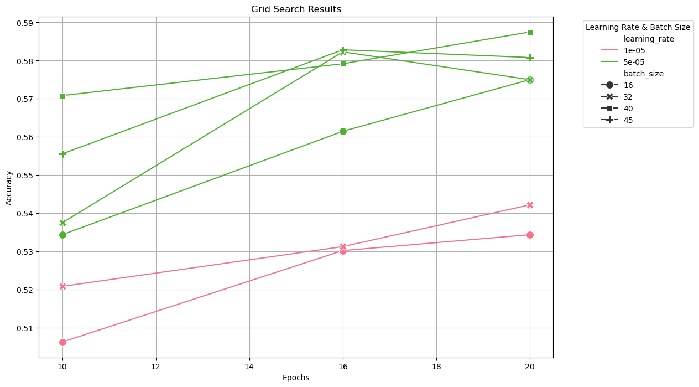
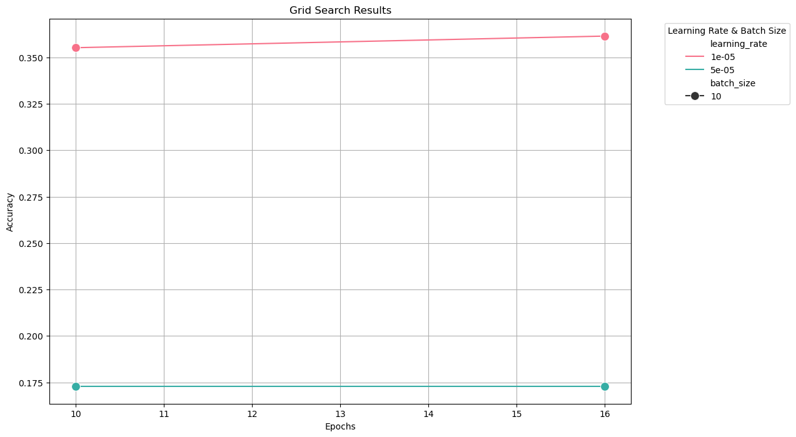
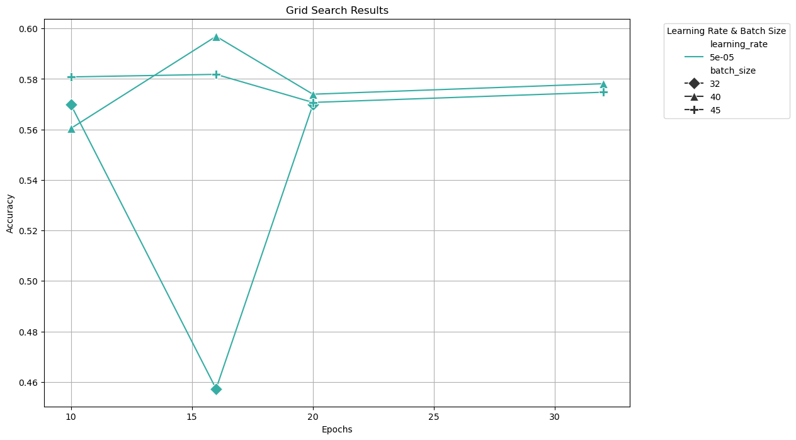
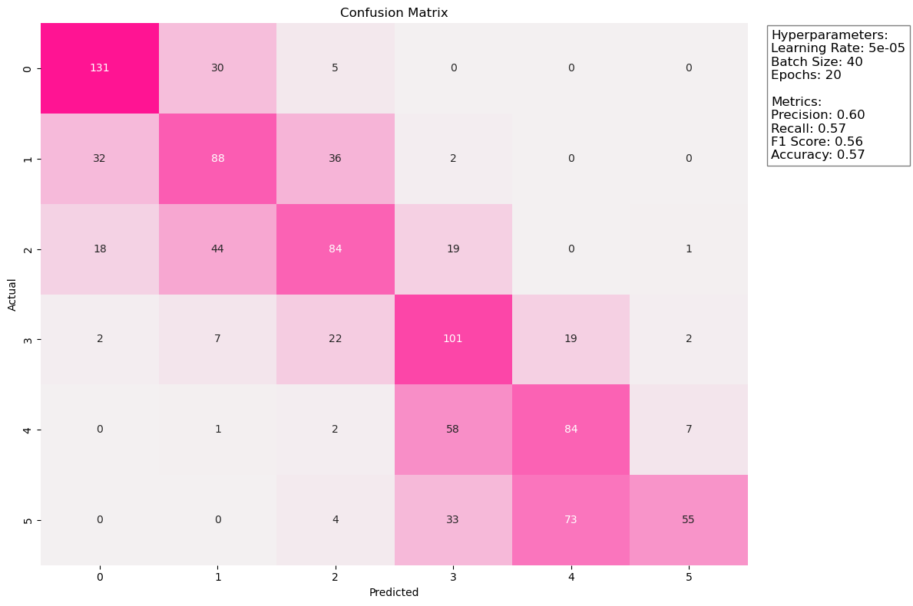
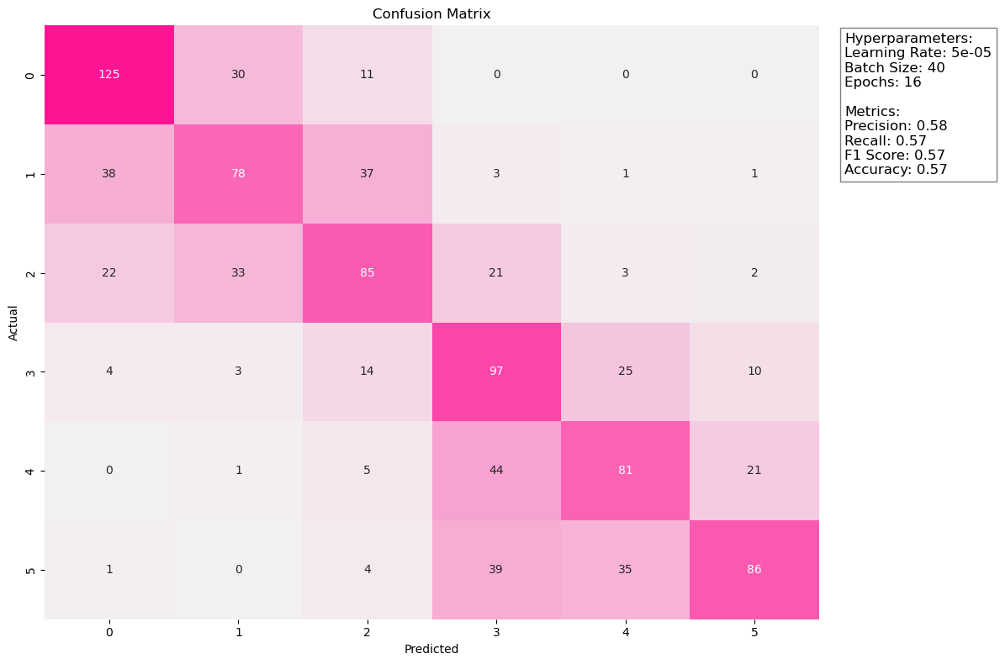
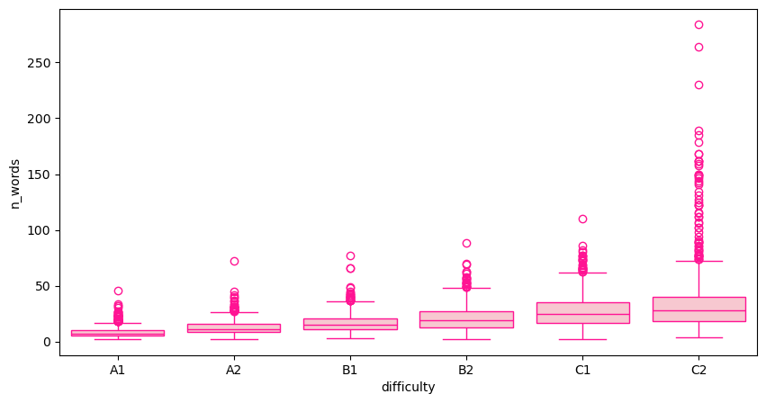
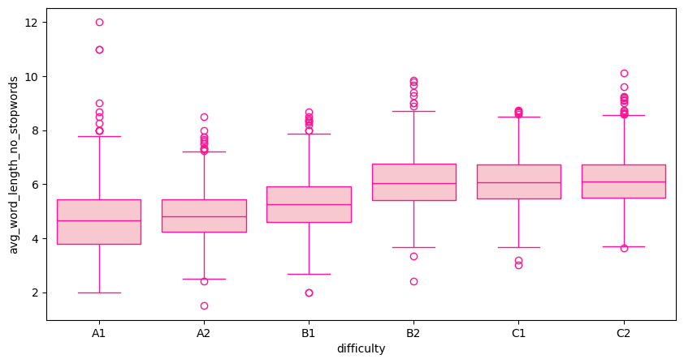
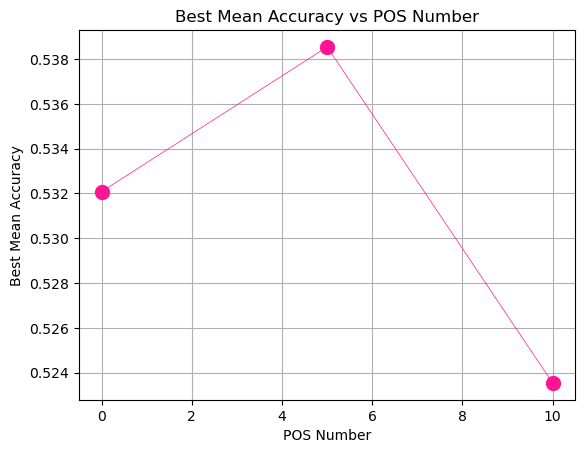
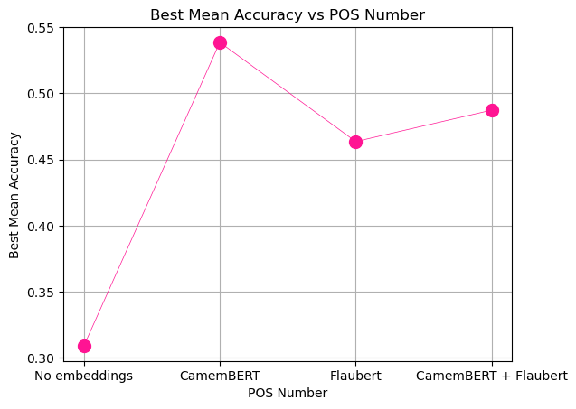
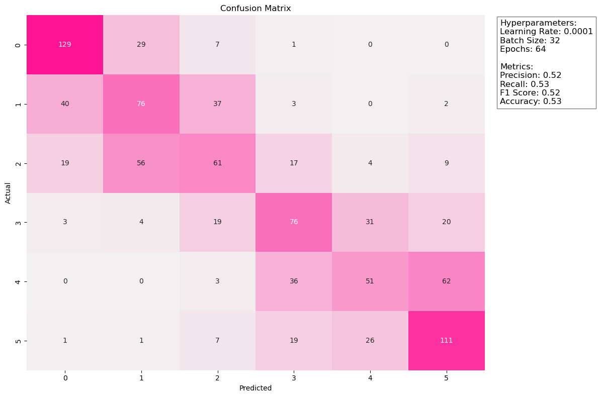

# Data Science and Machine Learning Course - Chiara Berretta and Beatrice Vaienti
Repository for the Data Science and Machine Learning course - Beatrice Vaienti and Chiara Berretta

# 0. Introduction
The goal of this project is to build a model that can predict the CEFR language difficulty of french sentences. The training set consists of # sentences labeled with the CEFR level, ranging from A1 to C2. 

To achieve this goal we explored multiple machine learning solutions to identify the most effective approach. After performing a __preliminary evaluation__ (see Section 1), we tested two different transformer models, CamemBERT and Flaubert (Section 2) and a Neural Network (Section 3). Then, in order to boost the accuracy of our model, we decided to combine these three models creating an ensemble model (Section 4). 

## 0.1 Folder Structure
This repository is thought with reusability in mind. As such, the code is organized in a modular way, with separate scripts for training, evaluation, and prediction and separate modules for models and utilities. 
The organization of the code is as follows:
- The `models` folder contains the code for initializing and configuring models, and in particular:
    - `model_bert.py`: containing the code for the initialization of the CamemBERT and Flaubert models;
    - `model_nn.py`: containing the architecture of the neural network that can be   trained on the embeddings of the sentences and the additional features extracted from the text;
    - `model_meta_nn.py`: containing the architecture of the neural network that can be trained on the predictions of the CamemBERT, Flaubert, and Neural Network models to combine them;
- The `utils` folder includes utilities for data preprocessing.
- The `scripts` folder houses scripts to evaluate, train, and make predictions with the models.

Saved hyperparameters and logs are stored in the `best_hyperparameters_saved` folder.
Trained models are saved in the `models_saved` folder.


# 1. Preliminary evaluation
report the following table without doing any cleaning on the data. Do hyper-parameter optimization to find the best solution. Your code should justify your results.

table:
|      | Logistic Regression | KNN | Decision Tree | Random Forest | Other technique |
|------|--------------------|-----|--------------|---------------|-----------------|
| Precision | 0.0 | 0.0 | 0.0 | 0.0 | 0.0 |
| Recall | 0.0 | 0.0 | 0.0 | 0.0 | 0.0 |
| F1 | 0.0 | 0.0 | 0.0 | 0.0 | 0.0 |
| Accuracy | 0.0 | 0.0 | 0.0 | 0.0 | 0.0 |

Answer the following questions
- Which is the best model?
- Show the confusion matrix.
- Show examples of some erroneous predictions. Can you understand where the error is coming from?
- Do some more analysis to better understand how your model behaves.


In the next sections we will describe the models that we trained (Flaubert, CamemBERT, Neural Network) and the ensemble model that we built combining them.

# 2. Flaubert / CamemBERT Model Training and Evaluation
As a first step, we trained and evaluated two transformer models, CamemBERT and Flaubert, on the dataset. We used the Hugging Face library to load pre-trained models and fine-tune them on our dataset. Our approach supports using either the CamemBERT or Flaubert model, selectable via command line.

## 2.1 Scripts
- `evaluate_bert.py`: Manages training and validation loops, performing hyperparameter tuning with a train-validation split.
- `train_bert.py`: Trains a selected model on the full dataset.
- `predict_bert.py`: Makes predictions on new, unlabeled data using a trained model.

In order to increase the batch size even without the computational resources, we used the __gradient accumulation technique__. This technique allows us to simulate a larger batch size by accumulating gradients over multiple steps before updating the model weights. In particular we set the gradient accumulation to calculate the steps in order to simulate a batch size of 64. However, we still evaluated the impact of different actual batch sizes, since, notwithstanding the gradient accumulation technique, the accuracy is still influenced by the actual batch size.

## 3.2 `evaluate_bert.py`: Hyperparameter Tuning and Evaluation with Grid Search
Hyperparameter tuning is performed using `evaluate_bert.py` with a grid search over predefined values for learning rates, batch sizes, and epochs. Each configuration is evaluated on the validation set, and the best-performing parameters are recorded. Results are saved in the `hyperparameters_log` folder.
Due to the computational cost of hyperparameter tuning, we opted to perform the evaluation with a simple train-validation split of 20%, without k-fold cross-validation. In particular, the full labelled dataset was split into train, test and evaluation. The test dataset was the one used to calculate the accuracy in the logs, the evaluation dataset was employed to obtain the scores and confusion matrix with the best hyperparameters.

To conduct hyperparameter tuning and evaluation, run:
```bash
python scripts/evaluate_bert.py --model [camembert|camembert-large|flaubert]
```

The `--model` argument specifies the model to use, with options for `camembert-base` (camembert), `camembert/camembert-large`, and `flaubert/flaubert_base_cased`. The script will perform hyperparameter tuning and save a log with the results of the grid search in the `best_hyperparameters_saved` folder. Given the computational cost of hyperparameter tuning, we decided to carefully pick the hyperparameters to test each time after some preliminary tests, without repeating the same ones for all the models. 

### Evaluation Results
The logs with all the tested combinations of hyperparameters and their validation accuracy can be found within the `best_hyperparameters_saved` folder. 


#### Hyperparameter Tuning Log
The log file contains the validation accuracy for each combination of hyperparameters tested during the tuning process. The best hyperparameters are selected based on the highest validation accuracy achieved. In the following table, we show the accuracy obtained for each combination of hyperparameters tested and for each model.
##### CamemBERT
The model used for CamemBERT is the `camembert-base` model. 
As a first test, we evaluated the following hyperparameters:
- Learning Rate: [1e-05, 5e-05];
- Batch Size: [16, 32, 40, 45] with __gradient accumulation__ to simulate a batch size of 64;
- Epochs: [10, 16, 20]


The results of this first experiment are shown in the following plot:



From this first experiment, the learning rate 5e-05 appears to consistently outperform the lower learning rate of 1e-05. As such, we decided to focus on this learning rate for the subsequent experiments. Noticing a trend of increasing accuracy with more epochs and for higher batch sizes we decided to explore further the batch sizes of 40 and 45, adding a longer epoch of 32. The results of this second experiment are shown in the following plot:


From the second experiment, we can see that a further increase of the epochs does not lead to an improvement in the accuracy. The best accuracy is obtained with a batch size of 40 and 20 epochs.
##### CamemBERT large
The model used for CamemBERT large is the `camembert/camembert-large` model. Given the computational cost of training the large model, we had to test it with a smaller range of hyperparameters and with a smaller batch size to avoid a memory error. The hyperparameters tested are:
- Learning Rate: [1e-05, 5e-05];
- Batch Size: [10] with __gradient accumulation__ to simulate a batch size of 64;
- Epochs: [10, 16]

The results of this experiment are shown in the following plot:


Consistently with the results obtained for the base model, the learning rate 5e-05 outperforms the lower learning rate of 1e-05. However, the best accuracy still appears largely lower than the one obtained with the base model. This is probably due to the fact that the large model is more complex and requires more data to be trained properly.

As a result, we decided to discard the large CamemBERT model and focus on the base CamemBERT model for the subsequent experiments.

##### Flaubert
The model used for Flaubert is the `flaubert/flaubert_base_cased` model.



In the following table, we summarize the best validation accuracy achieved for each model with the best hyperparameters found.

#### Hyperparameter Tuning Table
| Model      | Learning Rate | Batch Size | Epochs | Validation Accuracy |
|------------|---------------|------------|--------|---------------------|
| CamemBERT  | 5e-05         | 40         | 20     | 0.5875              |
| Flaubert   | 5e-05         | 40         | 16     | 0.596875            |

#### Confusion Matrices
The confusion matrices for the CamemBERT and Flaubert models obtained for the best hyperparameters are shown below, along with their accuracy, precision, recall, and F1-score. The confusion matrices were obtained by training the models with the best hyperparameters on a train-test split of 80-20 and then predicting on the test set.

#### Camembert Confusion Matrix


#### Flaubert Confusion Matrix



From the two confusion matrices we can notice that the most difficult class to predict is the C2 class, which in many cases is wrongly predicted as other classes, mainly C1. 


## `train_bert.py` , `predict_bert.py`: Training and Prediction
To train a model on the full dataset, execute:
```bash
python scripts/train_bert.py --model [camembert|camembert-large|flaubert]
```
The trained model will be saved in the `models_saved` folder.

To make predictions on the test set using a trained model, run:
```bash
python scripts/predict_bert.py --model [camembert|camembert-large|flaubert]
```
The model contained in the `models_saved` folder will be used to predict on the inference set, with results saved in the `predictions` folder.

# 4. Neural Network
The third model that can be optionally added into our ensemble model is a neural network, trained on the embeddings of the sentences and additional features extracted from the text. The neural network is configured with the best hyperparameters found in Section 4.3.1,  with the best POS tags number found in Section 4.3.2. and the best model for the generation of the embeddings found in Section 4.3.3.
## 4.1 Data Augmentation

To augment the data, we extracted the following attributes from the text:
- Number of words
- Average length of the words (excluding the stopwords)
- POS tags
The functions used to augment the data can be found in the `utils/data_augmentation.py` file, and an interactive generation of the augmented data can be done in the jupyter notebook at `notebooks/data_augmentation`

### 4.1.2 Number of Words
In the following plot we show the boxplots of the number of words per sentence and the related CEFR difficulty in the labelled dataset:



We can notice a correlation between the number of words and the CEFR level of the sentences. In particular, the sentences with a higher CEFR level tend to have more words. As such, we decided to include the number of words as an additional feature for the neural network.

### 4.1.3 Average Length of the Words
The average length of the words is calculated as the sum of the length of the words in the sentence divided by the number of words, excluding the stopwords. In the following plot we show the boxplots of the average length of the words per sentence and the related CEFR difficulty in the labelled dataset:



Also in this case, we can notice a correlation between the average length of the words and the CEFR level of the sentences. In particular, the sentences with a higher CEFR level tend to have longer words. As such, we decided to include the average length of the words as an additional feature for the neural network.

### 4.1.4 POS Tags
For the sake of readibility, the plots relative to POS tags are reported directly in the Jupyter Notebook `notebooks/data_augmentation`. The POS tags are extracted using the `nltk` library and the `nltk.pos_tag` function.

## 4.2 Embeddings
Embeddings for the sentences are generated using the selected transformer model (CamemBERT in this case). These embeddings, combined with the additional features, are used as input for model training.

while the ones for generating the embeddings are in the `utils/embeddings_generation.py` file.
In Section 4.3.2 we will describe the process that we followed to choose the best model for the generation of the embeddings and the impact that the addition of the embedding has on the accuracy of the model.

## 4.3 Model Optimization
We performed a grid search with a k-fold cross-validation to determine the best combination of data to augment and the best hyperparameters for the neural network. To run the code for the evaluation, use:

```bash
python scripts/evaluate_nn.py
```

The hyperparameters that we tested are:
- learning_rates = [1e-4, 5e-5]
- hidden_sizes = [32, 64]
- batch_sizes = [16, 32, 64, 128]
- epochs = [32, 64]

For each of the following analyses we tested all the combinations of hyperparameters and kept the best ones to compare. After determining the most successfull combination of augmented data (POS tags) and the best model for the generation of the embeddings, we evaluated the best hyperparameters for the neural network.

### 4.3.1 POS tags impact on the accuracy
Regarding the POS tags, we evaluated the impact on the accuracy of:
- not using any POS tags;
- using the 5 most frequent POS tags;
- using the 10 most frequent POS tags.

In the following plot we show the impact of the POS tags on the accuracy of the model. The best mean accuracy is calculated repeating the grid search with kfold cross-validaton for each of the three cases and selecting the case with the highest mean accuracy.




The plot shows that the best mean accuracy is obtained when using the __5 most frequent POS tags__: the reason probably lies in the fact that the infrequent POS tags are not very informative and can introduce noise in the model. As a consequence, we decided to use the 5 most frequent POS tags for the subsequent experiments.

### 4.3.2 Best Model for Embeddings Generation
In order to choose which model to use for the generation of the embeddings we repeated the grid search with kfold cross-validation for the following settings:
- __No embeddings__ + 5 most frequent POS tags.
- __CamemBERT embeddings__ + 5 most frequent POS tags;
- __Flaubert embeddings__ + 5 most frequent POS tags;
- Both __CamemBERT and Flaubert__ embeddings + 5 most frequent POS tags;


In the following plot we show the impact of the embeddings on the accuracy of the model.



The plot shows that the best mean accuracy is obtained when using the __CamemBERT embeddings__. 
 The best mean accuracy that can be obtained for CamemBERT is equal to 0.5385 while the one for Flaubert is 0.4635. As such, we decided to employ CamemBERT (`camembert-base`) to tokenize the test and generate the embeddings.

 ### 4.3.3 Determining the Best Hyperparameters for the Neural Network
The best hyperparameter found with the CamemBERT embeddings and the 5 most frequent POS tags are the following:
- learning_rate = 0.0001
- hidden_size = 64
- batch_size = 16
- epochs = 64

The best mean accuracy obtained with these hyperparameters is __0.5385__. The results of the grid search with kfold cross-validation can be found in the `embeddings_evaluation/nn_hyperparameter_log_cam-5pos.json` file.

### Evaluation Results
At last, we employed the best hyperparameters found to train a neural network on a train-test split of 80-20 and then predict on the test set. The confusion matrix obtained is shown below, along with the accuracy, precision, recall, and F1-score.



While the overall accuracy of the model is lower than the one obtained with the CamemBERT and Flaubert models, the neural network shows different strengths. In particular, the neural network is able to predict the C2 class with a higher accuracy than the other models. This is probably due to the fact that the neural network is able to capture the relationship between the attributes extracted from the text and the CEFR level of the sentences. As such it appears beneficial to combine the neural network with the CamemBERT and Flaubert models to obtain an overall better model. We will, in any case, present an evaluation of the different accuracy obtainable when incorporating or not the neural network in the ensemble model in the next section.


# 5. Ensemble Model
To obtain an overall better model we decided to build an ensemble model combining the CamemBERT and Flaubert models with (optionally) a Neural Network. The neural network was trained on the embeddings of the sentences and attributes derived from the text, in particular the number of words, the average length of the words, the POS tags. In the following section we will describe the data augmentation that was performed to create the training set for the neural network and the simple architecture of the neural network.


## 5.1 `ensemble_model/`: Folder Structure
The folder containing all the necessary models and data for the ensemble model is structured in the following way:
- `train/train_data.csv` contains the training data for the single models, obtained with a train-test split of the full labelled dataset using a 80-20 ratio and a random seed of 42.
- `test/test_data.csv` contains the test data on which the ensemble model will be trained on.
- `camembert/`, `flaubert/`, and `simple_nn/` folders contain the trained models for the CamemBERT, Flaubert, and Neural Network models, respectively. The models were trained exclusively on the train_data, ensuring no data leakage for the next step of training of the ensemble model. Given the size of the trained CamemBERT and Flaubert models, we decided to not include them in the repository.
- `meta_nn/` contains the trained model for the Neural Network used in the ensemble model.
- `meta_gb/` contains the trained model for the LightGBM model used in the ensemble model. 

## 5.2 `train_ensemble.py`: Training the Ensemble Model

To train the ensemble model, run:
```bash
python scripts/train_ensemble.py --use_nn
```

If specified using the flag `--use_nn`, the additional neural network (the one presented in Section 4) is trained on the combined features and embeddings. This neural network is configured with the best hyperparameters (learning rate, hidden layer size, and number of epochs) and with the best combination of augmented data, as found in Section 4.

Given the computational intensity of re-training the single models each time from scratch, the training script uses a consistent train-test split of the full labelled dataset to train the single models. The predictions of the single models are then used to train the ensemble model. If the single models are already present in the `ensemble_model/` folder, the `train_ensemble.py` function loads them and uses them to create predictions on the test set. The trained ensemble model will be saved in the `ensemble_model/` folder.

## 5.3 Combination Techniques: Neural Network and lightGBM
To combine the CamemBERT, Flaubert, and Neural Network models, we tested two different approaches:
1. LightGBM: We used the predictions of the CamemBERT model, Flaubert model, and Neural Network as features for a LightGBM model. LightGBM is a gradient boosting framework that uses tree-based learning algorithms. We performed hyperparameter tuning to find the best parameters for the LightGBM model.
2. Neural Network: We used the predictions of the CamemBERT model, Flaubert model, and LightGBM model as features for a Neural Network model. We performed hyperparameter tuning to find the best parameters for the Neural Network model.

### 5.3.1 LightGBM (MetaGB)
After loading the predictions of the CamemBERT, Flaubert, and Neural Network models, we performed a grid search to find the best hyperparameters for the LightGBM model. The tested hyperparameters are:
- learning_rate: [0.01, 0.1, 0.2]
- num_leaves: [31, 50, 100]
- max_depth: [-1, 10, 20]
- n_estimators: [50, 100, 200]


### 5.3.2 Neural Network (MetaNN)
We then performed a grid search on the Neural Network model to find the best hyperparameters. The tested hyperparameters are:
- learning_rate: [0.0001, 0.001, 0.01, 0.1]
- hidden_size: [32, 64, 128]
- epochs: [20, 50, 100, 150, 200]

After evaluating both meta models with a grid search, we found that the Neural Network model outperformed the LightGBM model. The best hyperparameters for the Neural Network model are:

- learning_rate: 0.01
- hidden_size: 128
- epochs: 50

We therefore trained the MetaNN model with these hyperparameters. First we trained it on a subset of the test data to evaluate its performance, then we trained it on the full test data to make predictions on the test set. The following confusion matrix shows the results of the MetaNN model trained on a subset of the test data.


## 5.4 Limitations
The limited amount of data available for the training constitutes an important limitation, especially when training a meta model. This strategy would have benefitted from the creation of an additional labelled synthetic dataset.

## 5.4 `train_ensemble.py`: Ensemble Model Training
To train the ensemble model, run:
```bash
python scripts/train_ensemble.py --use_nn
```
Use the flag `--use_nn` to include the neural network in the ensemble model. The trained model will be saved in the `ensemble_model` folder.

In the following subsection we will describe the process that is followed to train the ensemble model.

### 5.4.1 Training the Single Models
The first step consists in training the single models that will be later combined. However, since the ensemble models will be trained on their predictions, we need to train them on a portion of the full labelled dataset, thus, we split it into train and test set. The train set will be used to train the single models one by one. Then, they will be used to predict the labels on the test set. These predictions will be used to train the ensemble model of the chosen type.

### 5.4.2 Training the Ensemble Models
The next step involves training the meta models. Depending on the `--use_nn` flag, we trained either a LightGBM model or a Neural Network model on the predictions of the single models.

These are the steps followed in both cases:
- Load the predictions of the single models on the test set.
- Perform hyperparameter tuning using grid search to find the best parameters for the meta model (using the hyperparameters described in Section 5.3).
- Train the meta model on the predictions of the single models with the best hyperparameters found.
- Evaluate and save the trained meta model in the `ensemble_model` folder, respectively in the subfolders `meta_nn` and `meta_gb`.


### predict_ensemble.py: Prediction
To make predictions on the test set using the ensemble model, run:
```bash
python scripts/predict_ensemble.py --meta_model [lgb|nn]
```
NB: When using the script, remember to update the latest hidden size used in the neural networks.


Based on the chosen meta model type, the script will load the corresponding trained model and make predictions on the test set. The results will be saved in the `kaggle_submissions` folder.

# Best Model Combination and Accuracies Obtained for the Kaggle competition

| Model      | Accuracy    | 
|------------|-------------|
| Flaubert   | Placeholder | 
| CamemBERT  | Placeholder |
| MetaNN     | Placeholder |

# Future Work
comment on the fact that one limitation consists in the fact that we are not actually doing the k-fold for the transformers models, so the result is biased towards the specific split done on the data (especially considering that the dataset is limited) -> a potential future work would be a k-fold hyperparameter tuning

adding synthetic data


# Streamlit App: A Tandem Matching App

## Introduction
The current state of the art in tandem language exchange apps leverages advanced technology and social networking to facilitate language learning through mutual practice and cultural exchange. Leading platforms like Tandem, HelloTalk, Speaky, and ConversationExchange offer diverse features such as text, audio, and video chat, translation tools, and community forums. These apps use AI and machine learning to enhance user experience through personalized content and real-time corrections. Gamification elements like streaks, badges, and leaderboards are incorporated to maintain user engagement, while intuitive interfaces and seamless communication features make these apps user-friendly and effective.

Despite their strengths, there is room for improvement in tandem language exchange apps. Future advancements could include more immersive experiences using virtual reality (VR) and augmented reality (AR), allowing users to simulate real-life interactions in virtual environments. Further integration with formal education could provide structured learning paths and accreditation, enhancing the educational value of these platforms. Additionally, ongoing improvements in AI could lead to even more personalized learning experiences tailored to individual user needs and progress. By addressing these areas, tandem language exchange apps can continue to evolve and offer even more innovative and effective language learning solutions.

## Our project
For our project, we decided to focus on the language matching aspect of tandem language exchange apps. In particular, we employed our models to predict the CEFR level of French sentences to facilitate the matching of language learners with partners of similar proficiency.


The Proof of Concept of our application was tested with the PSI tandem group, to explore how this kind of app could be useful for university students and researchers. 

## Novelty
- check the coherence of the answer and the question. If we write in a different language or the answer is not coherent (showing that the user didn't understand the question), the app will suggest to the user to ask the question again or to write in the same language. 
- The test is progressive: the questions are asked in a progressively more difficult level. Moreover, if the user answers with a level that is already higher than the question the test jumps to the next level.


## Conclusion
This method not only makes the testing process more dynamic but also more accurately assesses the user's true language proficiency by adapting to their capabilities.
This approach ensures that unless the user demonstrates knowledge above A1, they are not advanced to a higher level, and if they fail to reach even A1, they are still reported at A1 since there isn't a lower level defined in your settings.
Partnering with existing educational platforms or content creators could allow you to incorporate their materials into your app legally and ethically.
# Conclusion