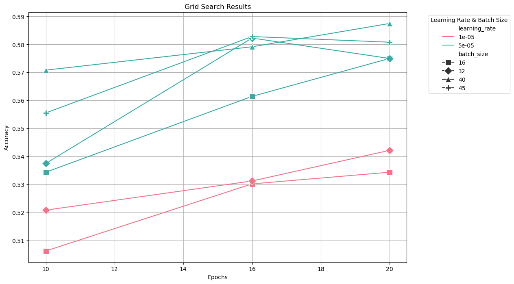

# Data Science and Machine Learning Course - Chiara Berretta and Beatrice Vaienti
Repository for the Data Science and Machine Learning course - Beatrice Vaienti and Chiara Berretta

# 0. Introduction
The goal of this project is to build a model that can predict the CEFR language difficulty of french sentences. The training set consists of # sentences labeled with the CEFR level, ranging from A1 to C2. 

To achieve this goal we explored multiple machine learning solutions to identify the most effective approach. After performing a __preliminary evaluation__ (see Section 1), we tested two different transformer models, CamemBERT and Flaubert.


# 1. Preliminary evaluation
report the following table without doing any cleaning on the data. Do hyper-parameter optimization to find the best solution. Your code should justify your results.

table:
|      | Logistic Regression | KNN | Decision Tree | Random Forest | Other technique |
|------|--------------------|-----|--------------|---------------|-----------------|
| Precision | 0.0 | 0.0 | 0.0 | 0.0 | 0.0 |
| Recall | 0.0 | 0.0 | 0.0 | 0.0 | 0.0 |
| F1 | 0.0 | 0.0 | 0.0 | 0.0 | 0.0 |
| Accuracy | 0.0 | 0.0 | 0.0 | 0.0 | 0.0 |

Answer the following questions
- Which is the best model?
- Show the confusion matrix.
- Show examples of some erroneous predictions. Can you understand where the error is coming from?
- Do some more analysis to better understand how your model behaves.


# Folder Structure
In our project, we explored multiple machine learning solutions to identify the most effective approach:
1. CamemBERT model
2. Flaubert model
3. A hybrid approach combining the previous two with a neural network on the sentence embeddings and augmented data (the attributes derived from the text).

The organization of the code is as follows:
- The `models` folder contains the code for initializing and configuring models.
- The `utils` folder includes utilities for data preprocessing.
- The `scripts` folder houses scripts to evaluate, train, and make predictions with the models.

Saved hyperparameters and logs are stored in the `best_hyperparameters_saved` folder.
Trained models are saved in the `models_saved` folder.

# Flaubert / CamemBERT Model Training and Evaluation
We used the Hugging Face library to load pre-trained models and fine-tune them on our dataset. Our approach supports using either the CamemBERT or Flaubert model, selectable via command line. 

## Scripts
- `evaluate_bert.py`: Manages training and validation loops, performing hyperparameter tuning with a train-validation split.
- `train_bert.py`: Trains a selected model on the full dataset.
- `predict_bert.py`: Makes predictions on new, unlabeled data using a trained model.

In order to increase the batch size even without the computational resources, we used the __gradient accumulation technique__. This technique allows us to simulate a larger batch size by accumulating gradients over multiple steps before updating the model weights. In particular we set the gradient accumulation to calculate the steps in order to simulate a batch size of 64. However, we still evaluated the impact of different actual batch sizes, since, notwithstanding the gradient accumulation technique, the accuracy is still influenced by the actual batch size.

## `evaluate_bert.py`: Hyperparameter Tuning and Evaluation with Grid Search
Hyperparameter tuning is performed using `evaluate_bert.py` with a grid search over predefined values for learning rates, batch sizes, and epochs. Each configuration is evaluated on the validation set, and the best-performing parameters are recorded. Results are saved in the `hyperparameters_log` folder.
Due to the computational cost of hyperparameter tuning, we opted to perform the evaluation with a simple train-validation split of 20%, without k-fold cross-validation. In particular, the full labelled dataset was split into train, test and evaluation. The test dataset was the one used to calculate the accuracy in the logs, the evaluation dataset was employed to obtain the scores and confusion matrix with the best hyperparameters.

To conduct hyperparameter tuning and evaluation, run:
```bash
python scripts/evaluate_bert.py --model [camembert|camembert-large|flaubert]
```

The `--model` argument specifies the model to use, with options for `camembert-base` (camembert), `camembert/camembert-large`, and `flaubert/flaubert_base_cased`. The script will perform hyperparameter tuning and save a log with the results of the grid search in the `best_hyperparameters_saved` folder. Given the computational cost of hyperparameter tuning, we decided to carefully pick the hyperparameters to test each time after some preliminary tests, without repeating the same ones for all the models. 

### Evaluation Results
The logs with all the tested combinations of hyperparameters and their validation accuracy can be found within the `best_hyperparameters_saved` folder. 


#### Hyperparameter Tuning Log
The log file contains the validation accuracy for each combination of hyperparameters tested during the tuning process. The best hyperparameters are selected based on the highest validation accuracy achieved. In the following table, we show the accuracy obtained for each combination of hyperparameters tested and for each model.
##### CamemBERT
The model used for CamemBERT is the `camembert-base` model. 
As a first test, we evaluated the following hyperparameters:
- Learning Rate: [1e-05, 5e-05];
- Batch Size: [16, 32, 40, 45] with __gradient accumulation__ to simulate a batch size of 64;
- Epochs: [10, 16, 20]


The results of this first experiment are shown in the following plot:



From this first experiment, the learning rate 5e-05 appears to consistently outperform the lower learning rate of 1e-05. As such, we decided to focus on this learning rate for the subsequent experiments. Noticing a trend of increasing accuracy with more epochs and for higher batch sizes we decided to explore further the batch sizes of 40 and 45, adding a longer epoch of 32. The results of this second experiment are shown in the following plot:


From the second experiment, we can see that a further increase of the epochs does not lead to an improvement in the accuracy. The best accuracy is obtained with a batch size of 40 and 20 epochs.
##### CamemBERT large
The model used for CamemBERT large is the `camembert/camembert-large` model. Given the computational cost of training the large model, we had to test it with a smaller range of hyperparameters and with a smaller batch size to avoid a memory error. The hyperparameters tested are:
- Learning Rate: [1e-05, 5e-05];
- Batch Size: [10] with __gradient accumulation__ to simulate a batch size of 64;
- Epochs: [10, 16]

The results of this experiment are shown in the following plot:


Consistently with the results obtained for the base model, the learning rate 5e-05 outperforms the lower learning rate of 1e-05. However, the best accuracy still appears largely lower than the one obtained with the base model. This is probably due to the fact that the large model is more complex and requires more data to be trained properly.

As a result, we decided to discard the large model and focus on the base model for the subsequent experiments.

##### Flaubert
The model used for Flaubert is the `flaubert/flaubert_base_cased` model.


In the following table, we summarize the best validation accuracy achieved for each model with the best hyperparameters found.

#### Hyperparameter Tuning Table
| Model      | Learning Rate | Batch Size | Epochs | Validation Accuracy |
|------------|---------------|------------|--------|---------------------|
| CamemBERT  | 5e-05         | 40         | 20     | 0.5875              |
| Flaubert   | 5e-05         | 40         | 16     | 0.596875            |

#### Confusion Matrices
The confusion matrices for the CamemBERT and Flaubert models obtained for the best hyperparameters are shown below, along with their accuracy, precision, recall, and F1-score.


From the two confusion matrices we can notice that the most difficult class to predict is the C2 class, which in many cases is wrongly predicted as other classes, mainly C1. 


## `train_bert.py` , `predict_bert.py`: Training and Prediction
To train a model on the full dataset, execute:
```bash
python scripts/train_bert.py --model [camembert|camembert-large|flaubert]
```
The trained model will be saved in the `models_saved` folder.

To make predictions on the test set using a trained model, run:
```bash
python scripts/predict_bert.py --model [camembert|camembert-large|flaubert]
```
The model contained in the `models_saved` folder will be used to predict on the inference set, with results saved in the `predictions` folder.

# Ensemble Model
To obtain an overall better model we decided to build an ensemble model combining the CamemmBERT and Flaubert models with a Neural Network. The neural network was trained on the embeddings of the sentences and attributes derived from the text, in particular the number of words, the average length of the words, the POS tags. In the following section we will describe the data augmentation that was performed to create the training set for the neural network and the simple architecture of the neural network.

Best MetaNN parameters found: {'learning_rate': 0.01, 'hidden_size': 128, 'epochs': 50}
Selecting MetaNN as the final model with accuracy: 0.6322916666666667


## Data Augmentation
To augment the data, we extracted the following attributes from the text:
- Number of words
- Average length of the words
- POS tags

And generated the embeddings of the sentences using the CamemBERT model. 
The functions used to augment the data can be found in the `utils/data_augmentation.py` file, while the ones for generating the embeddings are in the `utils/embeddings_generation.py` file.

## Combination Techniques

## Ensemble Model Training
To train the ensemble model, run:
```bash
python scripts/train_ensemble.py 
```

### predict_ensemble.py: Prediction
To make predictions on the test set using the ensemble model, run:
```bash
python scripts/predict_ensemble.py --meta_model [lgb|nn]
```
NB: in the script, remember to update the latest hidden size used in the neural networks.


Based on the chosen meta model type, the script will load the corresponding trained model and make predictions on the test set. The results will be saved in the `kaggle_submissions` folder.

# Accuracies obtained for the Kaggle competition

| Model      | Accuracy | 
|------------|----------|
| CamemBERT  | Placeholder | 
| Flaubert   | Placeholder |

# Conclusion


# Streamlit App
We created a Streamlit app to visualize the predictions of the models. The app allows users to input a text and see the predictions of the CamemBERT and Flaubert models. The app can be run locally by executing the following command:
```bash
streamlit run app.py
```
The app will open in a new browser window, and users can interact with it by entering text and seeing the model predictions. 
